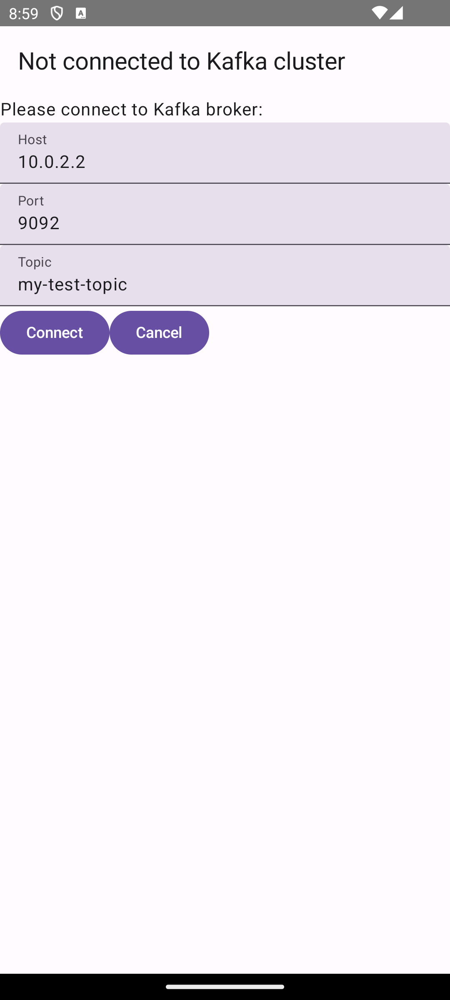
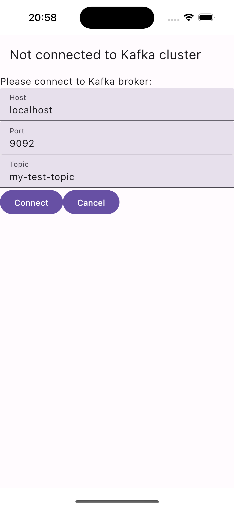
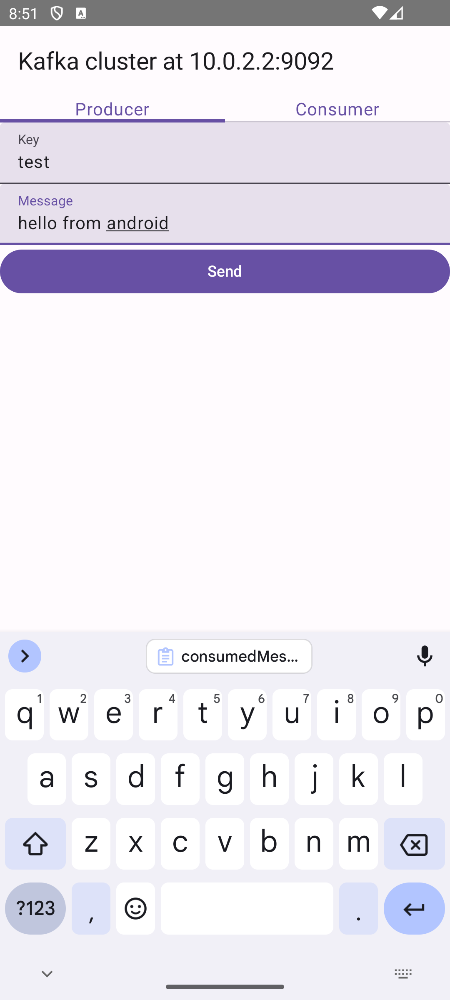
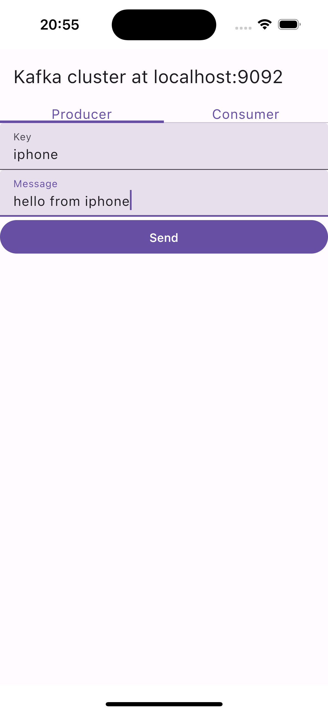
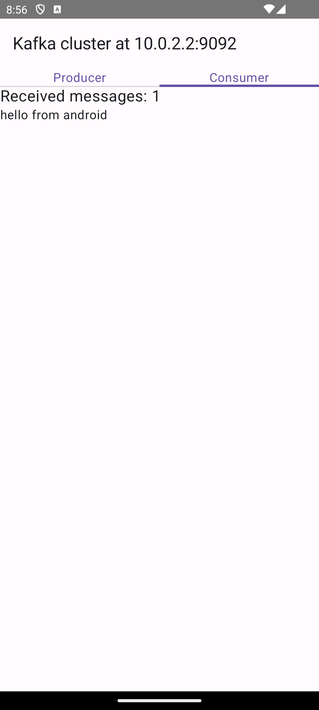
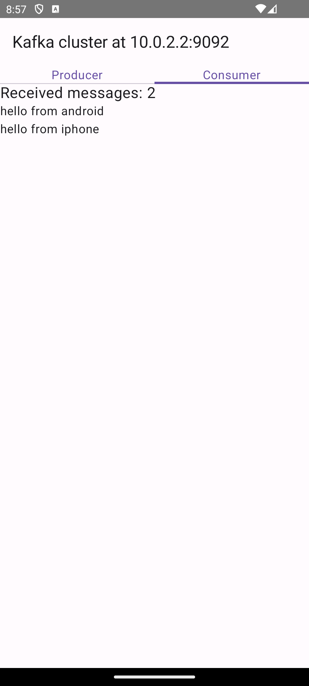
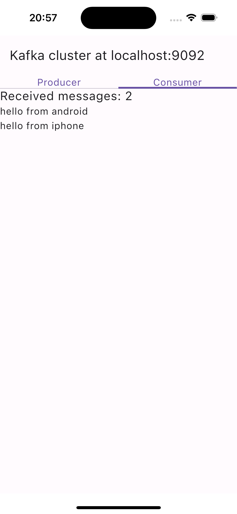
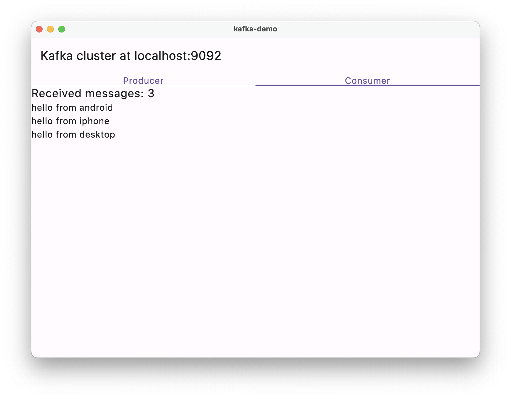

# kotlin-kafka-client demo app

This is a Compose Multiplatform app that demonstrates how to use the [kotlin-kafka-client](https://github.com/vooft/kotlin-kafka-client) library to produce and consume messages from a Kafka topic.

Android, iOS and Desktop are configured. This app has simple producer and consumer that exchange messages via shared Kafka broker.

## Android testing

Please note that there is an issue with running local Kafka cluster and Android app in the emulator. 

Since Android maps host's IP address to `10.0.2.2`, it can't access anything on the host machine by `localhost`.
However Kafka sends brokers addresses directly to clients, so if Kafka thinks its address is `localhost`, 
Android app will try to connect to `localhost` and will obviously fail.

There are some workarounds, but overall it is recommended to connect to an external cluster.

# Screenshots

### Connection screen

    
    

### Send screen

    
    

### Received screen

    
    
    
    

#### And one for the desktop

